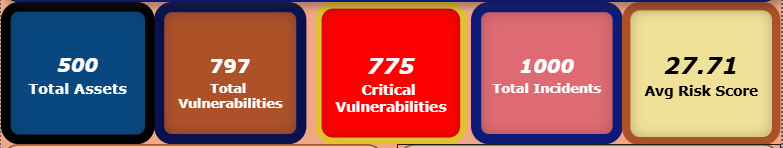
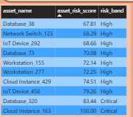

# 🛡️ Cyber Risk & Compliance Analytics Dashboard

## 📊 Project Overview
This project presents an end-to-end **Cyber Risk Analytics** solution built using **Python, MySQL, and Power BI**. It analyzes vulnerabilities, incidents, and remediation data to identify high-risk assets and support data-driven decision-making in an enterprise environment.

---

## 🚀 Key Features
* **Risk Analysis**: Quantifying risk across various departments (Finance, IT, HR, etc.).
* **Vulnerability Management**: Identifying and prioritizing critical CVEs.
* **Incident Intelligence**: Tracking trends and downtime impact over time.
* **Risk Prioritization**: Focus on the Top 10 Risky Assets using a custom scoring algorithm.
* **Interactive Visualization**: Comprehensive Power BI dashboard for executive reporting.

---

## 🛠️ Tech Stack
* **Python**: `pandas`, `numpy`, `faker` (Data Generation & Processing)
* **MySQL**: Relational Database Management & Analytical Querying
* **Power BI**: ETL, Data Modeling, and Interactive Dashboarding

---

## 📁 Project Structure
* `data/` → Synthetic raw and processed datasets (CSV)
* `scripts/` → Python scripts for data pipeline automation
* `sql/` → Database schema and advanced analytical queries
* `screenshots/` → Dashboard visuals and previews
* `Cyber-Risk-Analytics-Dashboard.pbix` → Interactive Power BI Dashboard file

---

## 📈 Key Insights
* **Departmental Risk**: IT and Finance departments consistently show the highest risk exposure due to high business value.
* **Critical Vulnerabilities**: A subset of vulnerabilities accounts for 80% of the total risk (Pareto Principle).
* **Incident Trends**: Correlation between unpatched critical vulnerabilities and security incidents.
* **Resource Optimization**: Top 10 assets contribute significantly to overall organizational risk.

---

## 🖼️ Dashboard Preview
Here are some previews of the interactive Power BI dashboard:

* **Executive Summary Dashboard**: A comprehensive high-level overview of the organization's real-time risk posture, highlighting total assets and critical alerts.*

* **Security KPIs & Metrics**: Tracking essential risk indicators, including Average Asset Risk Score, Total Open Critical Vulnerabilities, and remediation performance.*

* **Vulnerability Discovery Trends**: A temporal view of how many vulnerabilities are being discovered month-over-month, helping identify spikes in security events.*

* **Risk Level Distribution**: Visual representation of assets categorized into risk bands (Critical, High, Medium, Low) to prioritize security focus.*

* **Risk by Department**: A comparative analysis of cumulative risk scores across different business units like IT, Finance, and Operations.*

* **Asset Risk Details Table**: A granular, sorted view of assets, their individual risk scores, and the primary driver behind their risk level.*

* **Key Risk Insights**: Advanced analytics detailing top risk drivers and offering actionable recommendations for the remediation team.*

---

## 💡 Outcome
Developed a complete, production-quality analytics pipeline that transforms raw security data into actionable insights, enabling a proactive approach to cyber risk management.

---

## 📋 How to Run
1.  **Environment**: Install Python and run `pip install pandas numpy faker`.
2.  **Generate Data**: Execute `python scripts/data_generator.py` and `python scripts/data_processor.py`.
3.  **Database**: Load `sql/schema.sql` into MySQL and import the processed CSVs.
4.  **Visualize**: Connect Power BI to the MySQL database or the processed CSV files.

---

## 🎯 Resume Bullets
- *Developed an end-to-end Cyber Risk Analytics pipeline using Python and MySQL to quantify enterprise risk across 500+ assets.*
- *Engineered a custom risk-scoring algorithm incorporating CVSS v3.1 scores, business criticality, and incident impact.*
- *Designed a 4-page Power BI executive dashboard providing visibility into compliance posture and security SLAs.*

---

## 👤 Author
**Ayush Kumar**
📧 [ayushkumarwork2554@gmail.com](mailto:ayushkumarwork2554@gmail.com)
